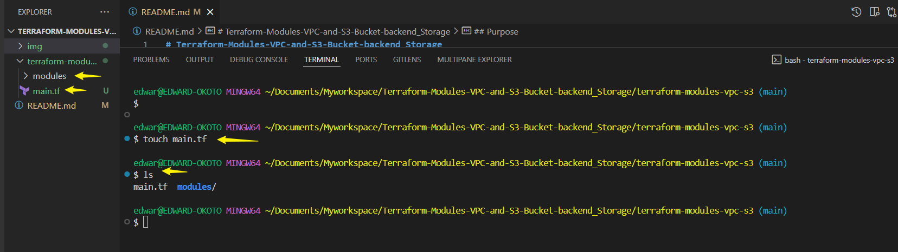
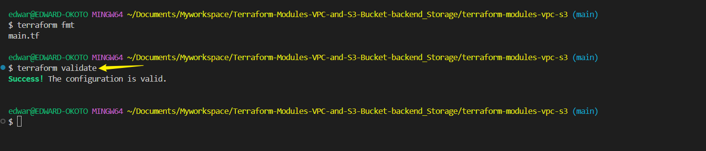

# Terraform-Modules-VPC-and-S3-Bucket-backend_Storage

## Purpose

Use Terraform to create modularized configurations for building an Amazon Virtual Private Cloud and an S3 bucket 

Configure Terraform to use Amazon S3 as the backend storage for storing the terraform statefile.

This project leverages **Terraform modules** to build an **Amazon VPC**, an **S3 bucket**, and **store the Terraform state** in the S3 backend. Let's go step by step:

---

### **Step-by-Step Explanation**

#### **1️⃣ Setting Up the Directory Structure**
Creating structured modules ensures better maintainability and reusability.

```bash
mkdir -p terraform-modules-vpc-s3/modules/vpc
mkdir -p terraform-modules-vpc-s3/modules/s3
cd terraform-modules-vpc-s3
```
This sets up the main project directory along with subdirectories for **vpc** and **s3** modules.


---

Create the root configuration file `main.tf` on the project root directory.

```
touch main.tf
```



#### **2️⃣ Creating the VPC Module**

```
touch modules/vpc/main.tf
```


The VPC module is defined in `modules/vpc/main.tf`. It:
- Creates a **VPC** using a customizable CIDR block.
- Defines **subnets** dynamically.
- Outputs the **VPC ID**.

```hcl
variable "vpc_cidr_block" {
  default     = "10.0.0.0/16"
  description = "CIDR block for the VPC"
}

variable "subnet_cidr_blocks" {
  type        = list(string)
  default     = ["10.0.1.0/24", "10.0.2.0/24"]
  description = "List of subnet CIDR blocks"
}

resource "aws_vpc" "main_vpc" {
  cidr_block = var.vpc_cidr_block

  tags = {
    Name = "MainVPC"
  }
}

resource "aws_subnet" "main_subnet" {
  count      = length(var.subnet_cidr_blocks)
  vpc_id     = aws_vpc.main_vpc.id
  cidr_block = element(var.subnet_cidr_blocks, count.index)

  tags = {
    Name = "MainSubnet-${count.index}"
  }
}

output "vpc_id" {
  value = aws_vpc.main_vpc.id
}
```
✔ This **modular approach** allows flexibility when creating a VPC in different configurations.


---

### **3️⃣ Using the VPC Module in `main.tf`**
Here, we **import the VPC module** in our root Terraform file.

```hcl
module "vpc" {
  source             = "./modules/vpc"
  vpc_cidr_block     = "10.1.0.0/16"
  subnet_cidr_blocks = ["10.1.1.0/24", "10.1.2.0/24"]
}

output "vpc_id" {
  value = module.vpc.vpc_id
}
```
✔ This **ensures modular reuse** and avoids redundant code.


---

### **4️⃣ Creating the S3 Bucket Module**
Define the **S3 bucket** inside `modules/s3/main.tf`.

```
touch modules/s3/main.tf

```


```hcl

resource "aws_s3_bucket" "state_bucket" {
  bucket = "example-s3-bucket-2025"

  tags = {
    Name = "TerraformStateBucket"
  }
}

resource "aws_s3_bucket_policy" "state_bucket_policy" {
  bucket = aws_s3_bucket.state_bucket.id

  policy = jsonencode({
    Version = "2012-10-17"
    Statement = [
      {
        Sid       = "AllowSpecificUserAccess"
        Effect    = "Allow"
        Action    = "s3:*"
        Resource  = [
          "${aws_s3_bucket.state_bucket.arn}/*",
          aws_s3_bucket.state_bucket.arn
        ]
        Principal = {
          AWS = "arn:aws:iam::491085391064:user/Edward"
        }
      }
    ]
  })
}

```
✔ This module makes **S3 bucket creation** flexible.


---

### **5️⃣ Using the S3 Module in `main.tf`**

Add the codes below to the `main.tf` in the root directory.

Please include the `providers` configuration on the `main.tf`

```hcl
provider "aws" {
  region  = "us-east-1"
  profile = "Terraform-user"  # Replace with your actual profile

module "s3" {
  source      = "./modules/s3"
}

```
✔ This **abstracts complexity** from the main Terraform file.


---

### **6️⃣ Configuring Terraform Backend Storage**
We store Terraform’s state **securely** in an S3 bucket using `backend.tf`.

In the root directory,create the `backend.tf` file

```
touch backend.tf
```


Add these backend configuration to the `backend.tf` file

```hcl
/*
terraform {
  backend "s3" {
    bucket  = "example-s3-bucket-2025"
    key     = "terraform/state"
    region  = "us-east-1"
    encrypt = true
  }
}
*/
```


✔ Enables **remote state storage** rather than saving state locally.


### **7️⃣ Ensuring S3 Bucket is Created Before Backend Configuration**
When using **S3 as a backend**, the bucket **must exist before Terraform initializes**. Instead of defining backend **inside `backend.tf` initially**, we first create the **S3 bucket**:

```hcl
resource "aws_s3_bucket" "state_bucket" {
  bucket = "example-s3-bucket-2025"

  tags = {
    Name = "TerraformStateBucket"
  }
}

resource "aws_s3_bucket_policy" "state_bucket_policy" {
  bucket = aws_s3_bucket.state_bucket.id

  policy = jsonencode({
    Version = "2012-10-17"
    Statement = [
      {
        Sid       = "AllowSpecificUserAccess"
        Effect    = "Allow"
        Action    = "s3:*"
        Resource  = [
          "${aws_s3_bucket.state_bucket.arn}/*",
          aws_s3_bucket.state_bucket.arn
        ]
        Principal = {
          AWS = "arn:aws:iam::491085391064:user/Edward"
        }
      }
    ]
  })
}
```
✔ Once the **S3 bucket is created**, uncomment `backend.tf`, **re-run Terraform**, and ensure the backend takes effect.

---
### **Step 1: Initialize Terraform**
```bash
terraform init
```
✔ Downloads Terraform provider plugins and sets up the workspace.


- **terraform fmt**: Automatically formats Terraform configuration files to follow proper coding conventions.  

  ```
  terraform fmt
  ```
  

- **terraform validate**: Checks the configuration for syntax errors and logical issues before applying changes. 

  ```
  terraform validate
  ```

  

- **terraform plan**: Shows a preview of the changes Terraform will make before applying them. 

```
terraform plan
```


#### **Step 2: Apply Configuration**
```bash
terraform apply -auto-approve
```


✔ Deploys the **VPC, Subnets, and S3 bucket**.

#### **Step 3: Set Up Backend Storage**
- Uncomment the `backend.tf` section.


- Run:
```bash
terraform init
```


```bash
terraform apply
```


✔ **Terraform state** will now be stored securely in **S3**.

### Uncomment the VPC module to create VPC resources

I had commented on the VPC resources earlier to get the S3 bucket and backend running smoothly.

-Uncomment on all if you have,run `terraform init` to initialize any new module.


  and `terraform apply`


---

## **Areas for Improvement**
### 🔹 **IAM Role for Secure Backend Storage**
Instead of allowing an AWS user (`arn:aws:iam::491085391064:user/Edward`), **create an IAM role** for Terraform execution.

### 🔹 **DynamoDB for State Locking**
To prevent simultaneous Terraform executions:
```hcl
terraform {
  backend "s3" {
    bucket         = "example-s3-bucket-2025"
    key            = "terraform/state"
    region         = "us-east-1"
    encrypt        = true
    dynamodb_table = "terraform-lock"
  }
}
```
✔ Enables **state locking** for concurrency.

### 🔹 **Multiple Availability Zones for Subnets**
Instead of using **static subnets**, dynamically distribute subnets across **availability zones**:
```hcl
resource "aws_subnet" "main_subnet" {
  count = length(var.subnet_cidr_blocks)

  vpc_id     = aws_vpc.main_vpc.id
  cidr_block = element(var.subnet_cidr_blocks, count.index)
  availability_zone = element(["us-east-1a", "us-east-1b"], count.index)

  tags = {
    Name = "MainSubnet-${count.index}"
  }
}
```
✔ Provides **higher availability**.

---

## **Summary**
✔ Terraform **modularizes VPC and S3 bucket creation**.  
✔ **Remote backend storage** ensures Terraform state is **secure**.  
✔ **State locking** prevents configuration conflicts.  
✔ Using **IAM roles** enhances security.  
✔ **Multi-AZ subnets** improve resilience.  

This approach **improves scalability, security, and manageability** in an AWS environment.